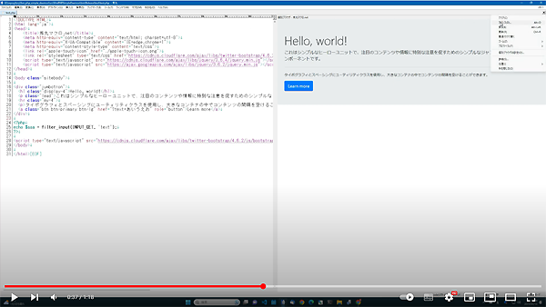

# hm_php_simple_daemon
秀丸エディタ - ブラウザ枠用 - 簡易デーモン

## https://github.com/komiyamma/hm_php_simple_daemon/releases  
- HmPHPSimpleDaemon.zip

[](https://www.youtube.com/watch?v=kzg6j6lnc_Q&t=3s&ab_channel=%E3%81%93%E3%81%BF%E3%82%84%E3%82%93%E3%81%BE%E3%81%AE%E7%A7%80%E4%B8%B8%E3%81%A1%E3%82%83%E3%82%93%E3%81%AD%E3%82%8)

## PHP配備 (すでにPCにPHP配置してある人はスキップ)
https://windows.php.net/download#php-8.2
のzip を適当に好きなのダウンロード。
zip ファイルを展開し適当な位置に配備


## HmPHPSimpleDaemon.mac のマクロ編集

```
$PHP_FULLPATH
```
の変数内容をダウンロードしたphpの「php.exe」までのフルパスを設定。

## HmPHPSimpleDaemon.mac のマクロの実行
適当に「.html」や「.php」などまぁブラウザで開けそうな適当な「ファイルを秀丸で開き」、  
「HmPHPSimpleDaemon.mac」を実行すると、「該当ファイルのフォルダを起点としてPHPサーバーが起動する」  
このため、個別ブラウザでhttpとして表示できる。  

**秀丸の１プロセスあたり、１つのサーバー**が起動する。
(よってそれぞれの秀丸の個別ブラウザに対して別々のサーバーが機能する)

## 再度 HmPHPSimpleDaemon.mac のマクロを実行すると？
**該当プロセスで起動中のPHPサーバー**が一旦終了し、再度起動する。
この際、それまでとは**Port番号が異なる**。
(全プロセスでマクロが実行される度にPort番号が１つずつ上がる。60000を超えると50001に戻る)

## 該当プロセスを閉じると？
該当プロセスで起動していたPHPサーバーは終了する。


